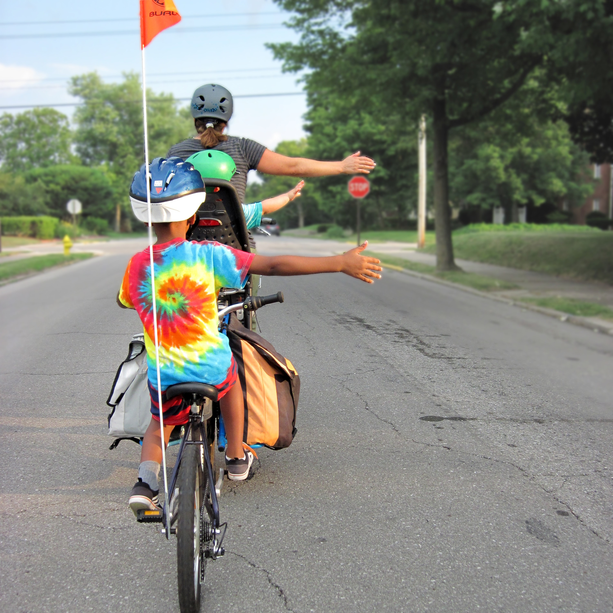

  
  
```{r setup, message=FALSE, warning=FALSE, include=FALSE}
library(metathis)
meta() %>%
  meta_description(
    "Website for the ISCycle Inclusive Sustainable Ebike Project"
  ) %>%
  meta_name("gitlab-repo" = "iscycle/website") %>%
  meta_viewport() %>%
  meta_social(
    title = "James Green",
    url = "https://iscycle.gitlab.io/website",
    og_type = "website",
    og_author = c("James Green"),
    twitter_card_type = "summary",
    twitter_creator = "@ajamesgreen"
  )
```

Thank you for your interest in our project. Because it hasn't officially launched yet, there is not much here. If you are here, you are probably here to sign up for the mailing list:

[Mailing List Signup](https://unioflimerick.eu.qualtrics.com/jfe/form/SV_6EFh8MAzb37GGPA)

```{r, echo = FALSE, fig.alt = 'Family cycling in town', fig.align = 'center', out.width = '60%'} 
  
```

<aside>Photo by <a href="https://unsplash.com/@markstos?utm_source=unsplash&utm_medium=referral&utm_content=creditCopyText">Mark Stosberg</a> on <a href="https://unsplash.com/@ajamesgreen/likes?utm_source=unsplash&utm_medium=referral&utm_content=creditCopyText">Unsplash</a>
  </aside>
